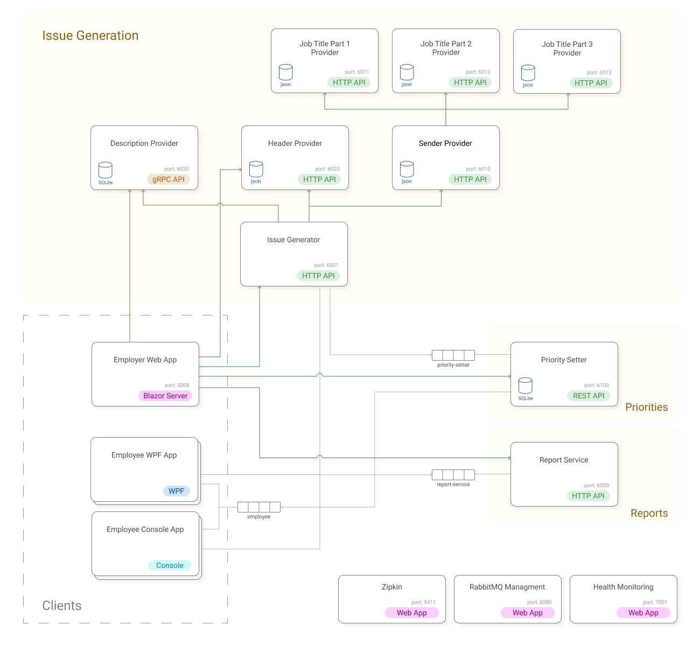

# DemoSystem

## Getting Started

Before first run, initialize SQLite databases in projects **DescriptionProvider** (IssueGenerator) and **PrioritySetter** (PrioritySetter). In Package Manager Console run:

```bash
update-database
```

Set **docker-compose** as startup project


## System Diagram

